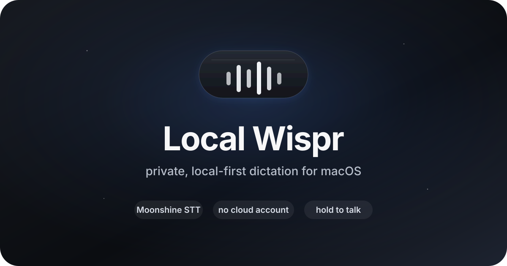
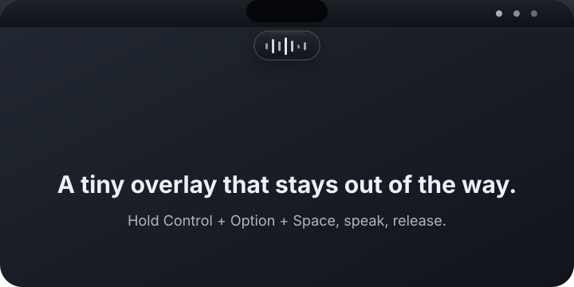
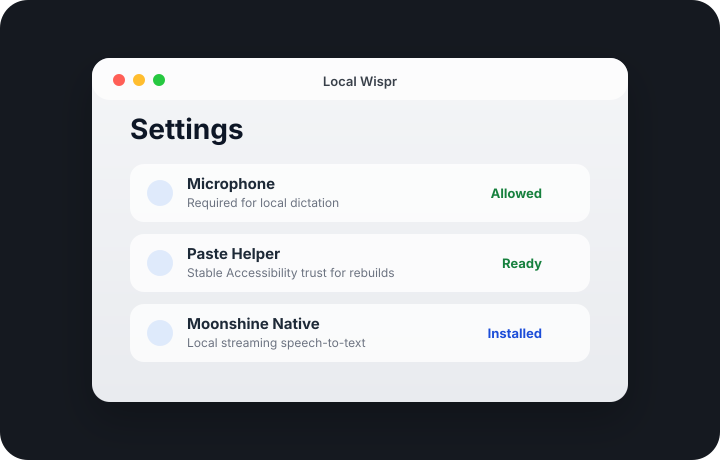

# Local Wispr

<p align="center">
  
</p>

<p align="center">
  <a href=".github/workflows/ci.yml"></a>
  
  
  
</p>

Local Wispr is a native macOS menu bar app for fast, private, hold-to-dictate transcription. Hold the hotkey, speak, release, and Local Wispr transcribes locally, lightly cleans up the text, and inserts it into the active app.

It is built for the part of dictation that should feel instant: local microphone capture, native streaming speech-to-text, minimal cleanup, and fast paste insertion.

## Why it exists

Most polished dictation tools are either cloud services, paid subscriptions, file-first transcription apps, or power-user products with a lot of surface area. Local Wispr is intentionally narrower:

- **Private by default** — no cloud transcription path, account, telemetry, or remote history.
- **Fast by design** — streaming Moonshine STT starts on key-down and finalizes on key-up.
- **Mac-native** — menu bar app, SwiftUI settings, matte listening overlay, paste helper, and macOS permissions.
- **Readable and hackable** — Swift package, simple scripts, local engine setup, timing logs, and focused tests.

## Preview

<p align="center">
  
  
</p>

## Features

- Hold-to-dictate hotkey: `Control` + `Option` + `Space`.
- Native Moonshine speech-to-text through `moonshine-swift` with streaming `.ort` models.
- Low-latency path: open stream on key-down, feed mic buffers live, finalize on release.
- Basic local cleanup by default; optional loopback `llama.cpp` cleanup server or Smart Cleanup V1 through OpenAI-compatible endpoints.
- Clipboard-preserving paste with focus and secure-field checks.
- Separate paste helper app so Accessibility permission can survive main-app rebuilds.
- Timing logs for every dictation session, including release-to-output latency.
- Small matte macOS-style listening overlay with live mic-reactive waveform bars.

## Quick start

Requirements:

- macOS 14 or newer
- Xcode Command Line Tools / Swift 6
- Microphone permission for dictation
- Accessibility permission for automatic paste; without it, output is copied for manual `Command-V`

```sh
git clone https://github.com/jackgladowsky/local-wispr.git
cd local-wispr
scripts/setup-local-engines.sh
scripts/install-app.sh
```

`install-app.sh` builds, installs, and launches:

```text
~/Applications/Local Wispr.app
~/Applications/Local Wispr Paste Helper.app
```

Open Local Wispr from the menu bar, complete permissions in **Settings**, then hold `Control` + `Option` + `Space` to dictate.

## Performance posture

Local Wispr is optimized around perceived dictation latency rather than batch transcription throughput:

1. **Capture begins immediately** after the hotkey is pressed.
2. **Native streaming STT is opened before speech ends**, so release does not have to start transcription from scratch.
3. **Full-session WAV conversion is deferred** unless the fallback batch path needs it.
4. **Final LLM cleanup is skipped by default** on the streaming fast path.
5. **Paste insertion is async-aware** and avoids blocking on clipboard restoration.

Every run writes timing fields such as `hotkey_to_recording_ms`, `stt_ms`, `insert_ms`, and `release_to_output_ms` to:

```text
~/Library/Logs/LocalWispr/mock-flow.log
```

See [`docs/performance.md`](docs/performance.md) for implementation notes, benchmark methodology, and market context against paid dictation tools.

## Local engines

Set up the default local runtime and check it:

```sh
scripts/setup-local-engines.sh
scripts/check-local-engines.sh
scripts/smoke-local-engines.sh
```

Default paths:

```text
Moonshine native model: ~/Library/Application Support/LocalWispr/Moonshine/models/en/medium-streaming
Moonshine sidecar venv: ~/Library/Application Support/LocalWispr/Moonshine/venv (optional fallback)
Cleanup model:          ~/Library/Application Support/LocalWispr/Models/cleanup/cleanup.gguf
```

Local Wispr uses Moonshine's native ONNX/C++ runtime through Swift. No Python process or localhost HTTP STT server is used when the native model is available.

Useful overrides:

```sh
LOCAL_WISPR_MOONSHINE_VOICE_ARCH=small-streaming scripts/setup-moonshine-native.sh
LOCAL_WISPR_MOONSHINE_VOICE_ARCH=tiny-streaming scripts/setup-moonshine-native.sh
LOCAL_WISPR_MOONSHINE_NATIVE_MODEL_DIR=/path/to/model scripts/install-app.sh
LOCAL_WISPR_MOONSHINE_STREAM_UPLOAD_SECONDS=0.05 scripts/install-app.sh
```

Optional LLM cleanup can use a local `llama.cpp` server through the legacy `/completion` endpoint:

```sh
scripts/start-llama-server.sh
LOCAL_WISPR_REWRITE_ENGINE=llama-server scripts/install-app.sh
```

Smart Cleanup V1 can also target local or hosted OpenAI-compatible chat completion APIs:

```sh
scripts/start-llama-server.sh
LOCAL_WISPR_REWRITE_ENGINE=smart-hosted \
LOCAL_WISPR_SMART_CLEANUP_URL=http://127.0.0.1:8080/v1/chat/completions \
LOCAL_WISPR_SMART_CLEANUP_MODEL=local-cleanup \
  scripts/install-app.sh
```

If no cleanup server is configured, Local Wispr uses Basic Local Cleanup.

## Privacy model

Local Wispr is local-first. It does not use cloud transcription, accounts, remote history, or analytics. Audio temp files are written under the system temp directory during a dictation session and removed afterward. Optional STT/cleanup services are restricted to loopback URLs by default.

See [`docs/architecture.md`](docs/architecture.md) for the system map and privacy boundaries.

## Developer workflow

```sh
swift test
scripts/build-app.sh
scripts/install-app.sh
scripts/package-release.sh
```

Repository layout:

```text
Sources/LocalWisprCore/        app logic
Sources/LocalWispr/            menu bar app entry point
Sources/LocalWisprPasteHelper/ stable paste helper
Packaging/                    app bundle plists
scripts/                      setup, build, install, release, and engine helpers
Tests/                        unit tests
```

## Documentation

- [`docs/architecture.md`](docs/architecture.md) — local pipeline, components, and privacy boundaries.
- [`docs/configuration.md`](docs/configuration.md) — environment variables and runtime toggles.
- [`docs/development.md`](docs/development.md) — local development commands and repo hygiene.
- [`docs/performance.md`](docs/performance.md) — latency strategy, benchmark notes, and market context.
- [`docs/troubleshooting.md`](docs/troubleshooting.md) — permissions, engines, paste helper, and logs.
- [`docs/release.md`](docs/release.md) — packaging, signing, notarization, and GitHub releases.

## Project status

Local Wispr is early, practical, and actively changing. The default path is tuned for Jack's local macOS workflow, but the codebase is structured to be readable and reusable.

## License

MIT — see [`LICENSE`](LICENSE).
