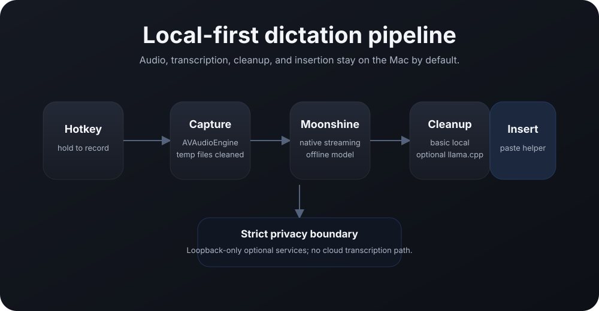

# Architecture

  

Local Wispr is built around one product promise: press a hotkey, speak, release, and get local text quickly without sending audio to a cloud service.

## Runtime pipeline

1. **Hotkey** — `HotkeyController` listens for `Control` + `Option` + `Space` and starts/stops a `DictationSession`.
2. **Capture** — `AudioCapture` records microphone buffers with `AVAudioEngine`, writes temporary local audio, and publishes live buffers for streaming STT and waveform UI.
3. **STT** — `MoonshineNativeEngine` opens a native Moonshine stream on key-down and finalizes it on key-up. `MoonshineServerEngine` remains a loopback-only fallback.
4. **Cleanup** — `RuleBasedRewriteEngine` / basic local cleanup is the default fast path. Optional `llama.cpp` cleanup can run through a loopback-only server.
5. **Insertion** — `InsertionController` and `LocalWisprPasteHelper` paste into the active target when Accessibility is trusted, or copy to the clipboard as a safe fallback.
6. **Logging** — `TimingLogger` appends structured pipeline timing fields for every success or failure.

## Component map

| Area | Main files | Responsibility |
| --- | --- | --- |
| App lifecycle | `AppDelegate.swift`, `LocalWisprApplication.swift` | menu bar app, settings, hotkey/session wiring |
| Audio | `AudioCapture.swift`, `AudioRecording.swift`, `AudioFileConverter.swift` | mic capture, temporary files, WAV conversion, live waveform levels |
| Dictation | `DictationSession.swift`, `StreamingSTTAudioFeeder.swift` | state machine, streaming/fallback orchestration |
| Engines | `MoonshineNativeEngine.swift`, `EngineRegistry.swift`, rewrite engines | STT and cleanup discovery/runtime selection |
| Insertion | `InsertionController.swift`, `PasteHelperController.swift`, `PasteboardSnapshot.swift` | target capture, paste, clipboard restore |
| UI | `Panel/`, `Settings/` | matte listening overlay and SwiftUI settings |
| Packaging | `Packaging/`, `scripts/build-app.sh`, `scripts/package-release.sh` | app bundles, helper bundle, release artifacts |

## Privacy boundaries

Local Wispr's default boundaries are intentionally strict:

- microphone audio is captured locally through AVFoundation;
- temporary audio files are removed after processing;
- native Moonshine runs in-process through Swift/ONNX/C++;
- optional HTTP services must be loopback-only unless explicitly changed;
- there are no accounts, cloud transcription requests, analytics, or remote history in the default path.

## Fallbacks

Fallbacks exist to keep dictation useful when a fast path fails:

- native streaming can fall back to batch STT;
- native Moonshine can fall back to the loopback Python sidecar for development;
- automatic paste can fall back to copying the text to the clipboard;
- optional LLM cleanup can fall back to Basic Local Cleanup.

Fallbacks should preserve privacy defaults and avoid adding startup latency to the normal path.
